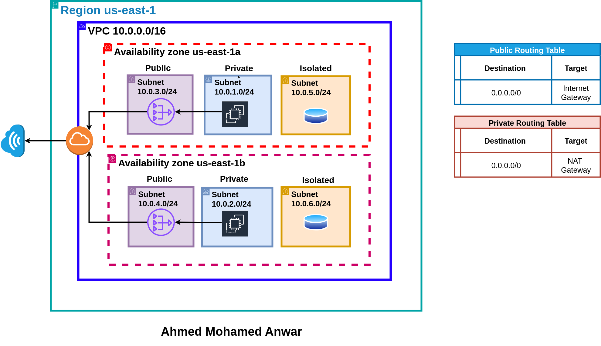

# AWS VPC with Subnetting using Terraform

## Project Overview
In this project, we create a **Virtual Private Cloud (VPC)** on AWS and subnet it into **6 subnets**:
- **Public Subnets**  
- **Private Subnets**  
- **Isolated Subnets**  

The subnets are distributed across **two Availability Zones (AZs)** to enhance **reliability, fault tolerance, and high availability**.

## Implementation
- Infrastructure as Code (IaC) is applied using **Terraform**.  
- The VPC is configured with appropriate **CIDR blocks**.  
- Routing tables and Internet/NAT gateways are set up to manage traffic between subnets.  
- Subnets are categorized as:
  - **Public** → Accessible from the internet (via Internet Gateway).  
  - **Private** → Internal services with outbound internet access (via NAT Gateway).  
  - **Isolated** → Restricted, no direct internet access (for databases or internal systems).  
- **Two NAT Gateways (NGWs)** were created, one in each AZ, to avoid a **Single Point of Failure (SPOF)** and ensure high availability.

---

*This project demonstrates best practices in AWS networking using Infrastructure as Code.*
